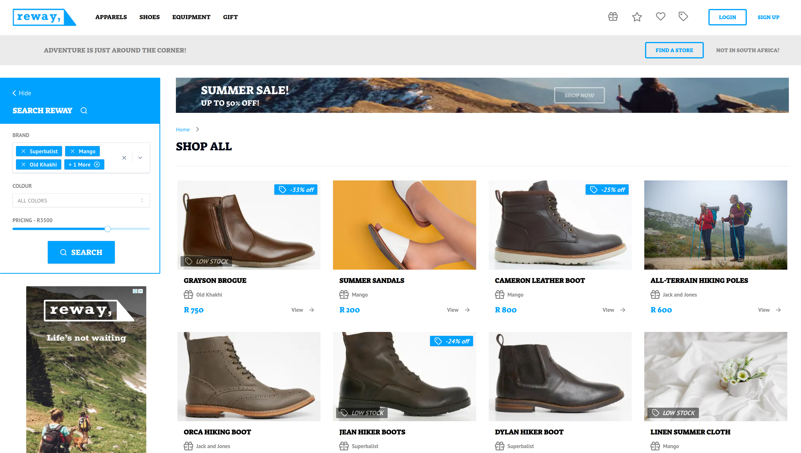
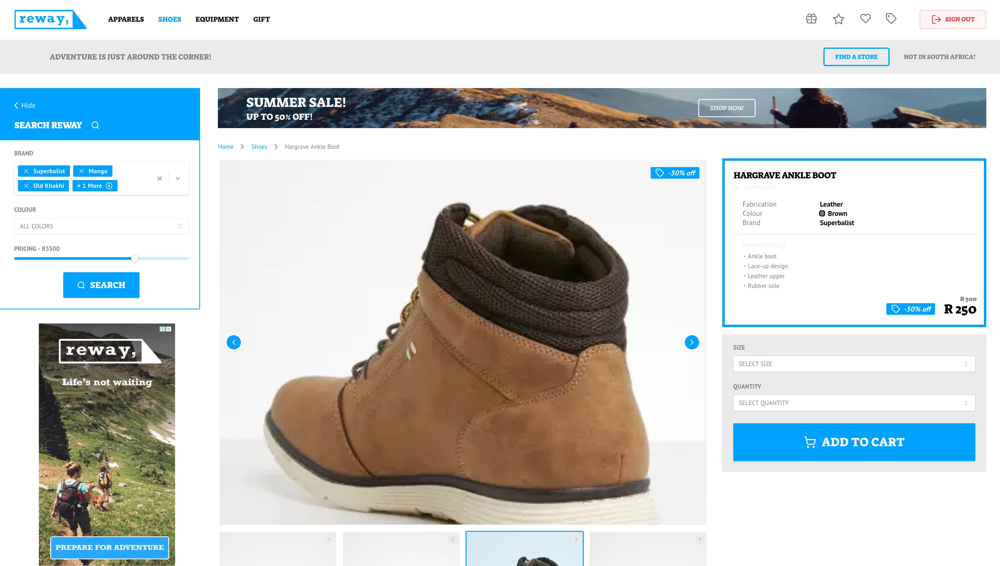
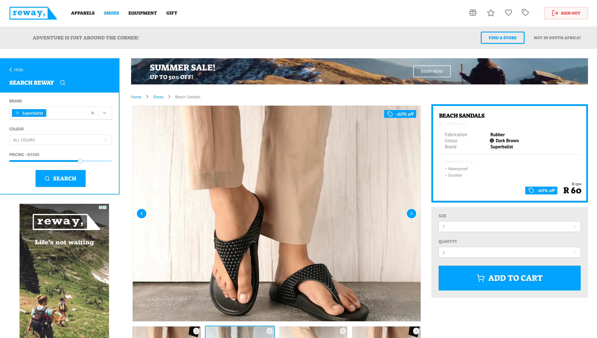
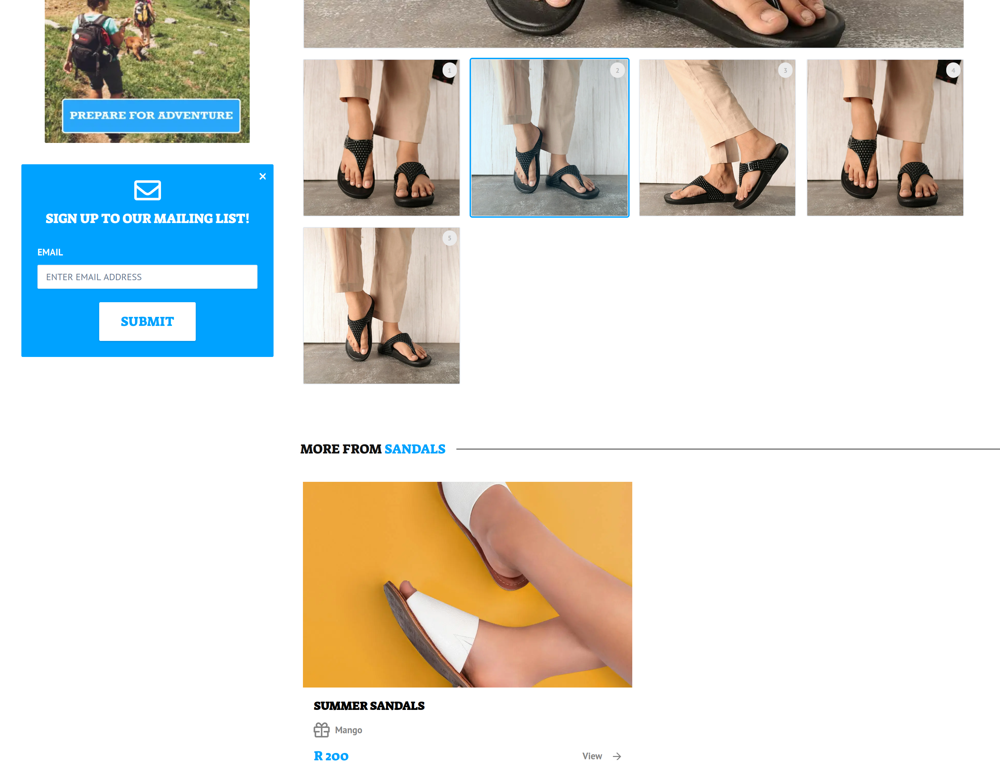
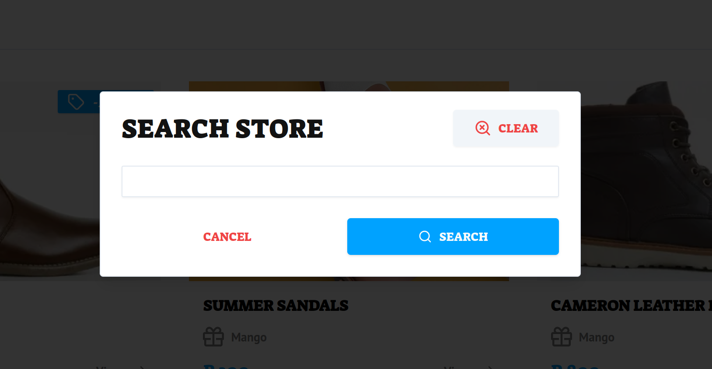
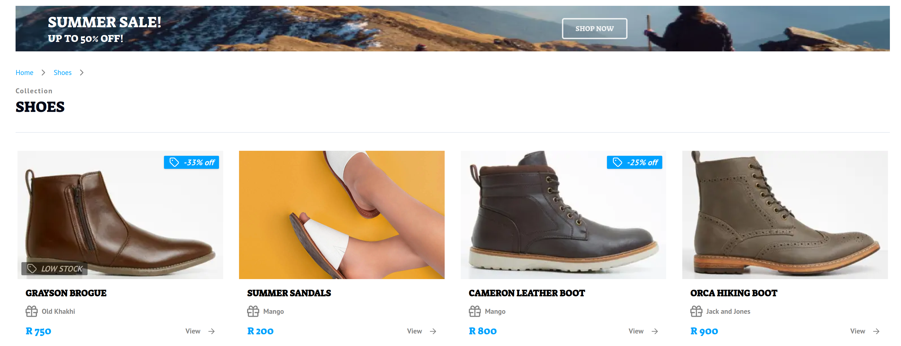
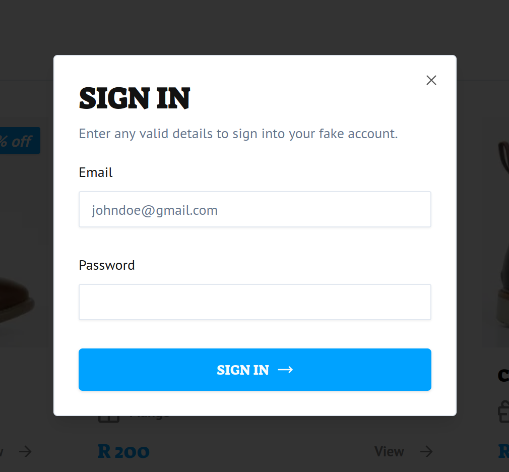
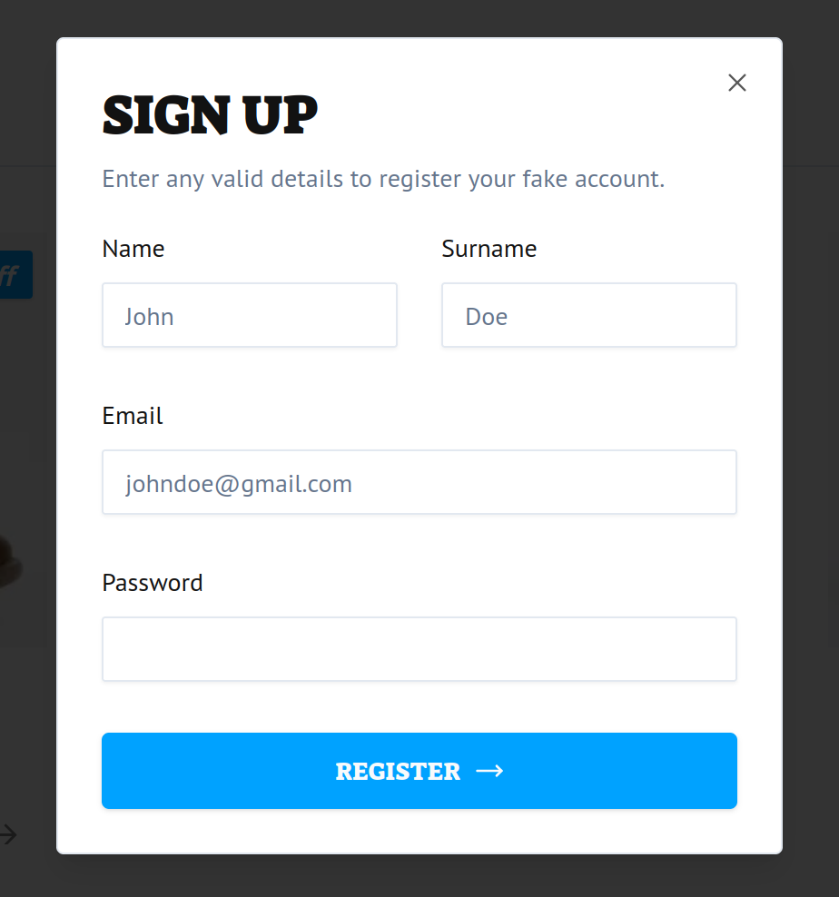
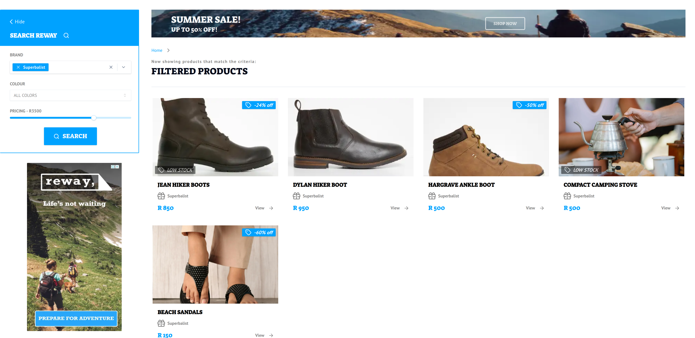

# Reway Store

Reway Store is a feature-rich e-commerce application that highlights modern web technologies and best practices for product browsing, filtering, and user authentication. This project leverages the power of Next.js 14, Zustand, and nuqs for state management, ensuring a seamless and efficient user experience.

While many opt for traditional state managers, Reway Store demonstrates the powerful capabilities of using URLs as a state store, providing enhanced flexibility and performance through options like shallow routing and throttling.


## Project Overview

### Frontend

- **Next.js 14**: Utilized for both server and client-side rendering, optimizing performance and SEO.
- **nuqs**: Primary state management using URL as the state store, ensuring shareable and bookmarkable links.
- **Zustand**: Used minimally for managing logged-in and logged-out states.
- **React Hook Form & ZOD**: Employed for form handling and schema validation, ensuring type safety and robust validation.
- **Tailwind CSS**: Applied for styling, providing a utility-first approach to design.
- **Radix UI**: Ensures accessible and high-quality UI components.
- **Sonner**: Used for toast notifications.

### Additional Packages

- **Class Variance Authority**: For variant-based styling - an example in our code is how we have different button sizes as per the Figma design.
- **Embla Carousel React**: For responsive carousels.
- **Lucide React**: Icon components.
- **FontAwesome**: Icon library.

### Key Features

- **Authentication**: Mimicked login and registration functionality.
- **Store Browser**: Browse all products with collections and categories.
- **Search**: Search products based on the name.
- **Filter**: Filter products by brands, colors, and price range.
- **Product Details**: View detailed product information with image carousel and product configurator. You can zoom in on images and select product options.
- **State Management**: Utilizing URL for primary state management and Zustand for session state.

## Recent Hardening Updates

### Rendering Strategy & Route Hardening

- **SSG (Static Site Generation) for Product Detail Routes**: Product detail pages now use `generateStaticParams` in App Router dynamic routes (`/shoes/[slug]`, `/apparels/[slug]`, `/equipment/[slug]`, `/gift/[slug]`) so known product URLs are generated at build time.
  - **Why included**: Reduces runtime server/edge work for high-traffic product pages.
  - **Issue solved**: Prevents avoidable request-time compute and improves response consistency.

- **Strict Dynamic Param Validation (`dynamicParams = false`)**: Unknown slugs are rejected instead of being rendered on-demand.
  - **Why included**: Enforces a strict allowlist of valid product route params.
  - **Issue solved**: Reduces bot-driven random slug scans that inflate Edge Requests.

- **SSR (Server-Side Rendering) preserved for query-driven routes**: `/search` and `/filter` remain request-time rendered because their output depends on URL query params.
  - **Why included**: Query state must be evaluated per request for accurate search/filter results.
  - **Issue solved**: Maintains correct URL-driven behavior while hardening expensive dynamic routes.

- **Framework-native 404 flow (`notFound()` + `app/not-found.tsx`)**:
  - **Why included**: Uses Next.js App Router canonical not-found handling.
  - **Issue solved**: Avoids inconsistent fallback rendering and improves crawler handling for invalid paths.

### Crawl & Indexing Controls

- **REP (Robots Exclusion Protocol) via `robots.txt` metadata route**: Added App Router robots metadata route and route-level robots policy.
- **`noindex,nofollow` for query-heavy pages**: Applied to `/search` and `/filter`.
  - **Why included**: Query pages are high-cardinality and expensive for crawl budgets.
  - **Issue solved**: Reduces crawler-driven Edge Requests and indexing churn.

### Transfer & Request Optimization

- **Prefetch policy tuning (`prefetch={false}` on high-cardinality link surfaces)**:
  - **Why included**: Limits speculative prefetch fan-out from large product grids/navigation.
  - **Issue solved**: Reduces background request volume that contributes to Edge overages.

- **Next.js Image Optimization tuning**:
  - Added explicit responsive `sizes`.
  - Enabled modern formats (`AVIF`, `WebP`) and tuned cache settings (`minimumCacheTTL`, curated size sets).
  - **Why included**: Improves image payload selection and cache efficiency.
  - **Issue solved**: Reduces Fast Origin Transfer and image-related bandwidth waste.

### URL State Reliability (nuqs)

- **URL-as-source-of-truth parser alignment**:
  - Removed implicit filter defaults that made filter state appear active without URL params.
  - Simplified conflicting query update flows.
  - Corrected select trigger behavior and state synchronization in form controls.
  - **Why included**: Keeps query params, forms, and rendered output deterministic.
  - **Issue solved**: Fixes search/filter/options behavior where URL state appeared non-functional.

### Hydration & Semantic Stability

- **Hydration mismatch hardening**:
  - Fixed invalid DOM nesting and semantic structure inconsistencies.
  - Added client hydration guard for persisted auth-dependent UI branch.
  - **Why included**: Preserves SSR/CSR markup parity.
  - **Issue solved**: Eliminates runtime hydration mismatch errors.

### Security Baseline

- **Patched Next.js Runtime Upgrade**: Upgraded from `14.2.5` to `14.2.35` as part of RSC/App Router hardening.
  - **Why included**: Aligns runtime with patched security line for known advisories.
  - **Issue solved**: Mitigates exposure tied to vulnerable versions.

- **Reference**: React security advisory on React Server Components  
  https://react.dev/blog/2025/12/03/critical-security-vulnerability-in-react-server-components

## Advantages of Using URL for State Management

1. **Sharable Links**: Users can share URLs to preserve the current state of the application.
2. **Bookmarkable**: Users can bookmark specific states, such as a product configuration.
3. **Consistent State Management**: URL state management works seamlessly with server components in Next.js 14.
4. **SEO Benefits**: URLs with meaningful query parameters improve search engine indexing.
5. **Simplified State Synchronization**: The URL acts as a single source of truth, avoiding discrepancies between client and server states.
6. **Optimized Server Requests**: Options like shallow routing minimize unnecessary server requests.
7. **High-Frequency Updates**: Throttling ensures efficient handling of high-frequency updates, enhancing performance.

### Areas of Improvement

- **Enhanced Search Functionality**: Improving search to include more product attributes.
- **Pagination**: Implementing pagination for better performance with large datasets.

## Getting Started

1. **Set environment variables (optional but recommended)**:

   ```
   cp .env.example .env.local
   ```

   `NEXT_PUBLIC_SITE_URL` is used for host-aware metadata (for example, `robots.txt` generation).

2. **Install dependencies**:

   ```
   npm install
   ```

3. **Start the development server**:

   ```
   npm run dev
   ```

4. **Build for production**:

   ```
   npm run build
   ```

5. **Start the production server**:

   ```
   npm start
   ```

## Screenshots











### Important Notes

- **No Real Transactions**: This application uses dummy data and no real transactions are made.
- **State Management**: URL state management ensures a consistent user experience across sessions and devices.

## Conclusion

Reway Store exemplifies modern e-commerce applications by leveraging URL state management for a seamless and user-friendly experience. This approach ensures that the application is highly performant, easy to maintain, and adaptable to future web technologies, making it a robust solution for online stores.
